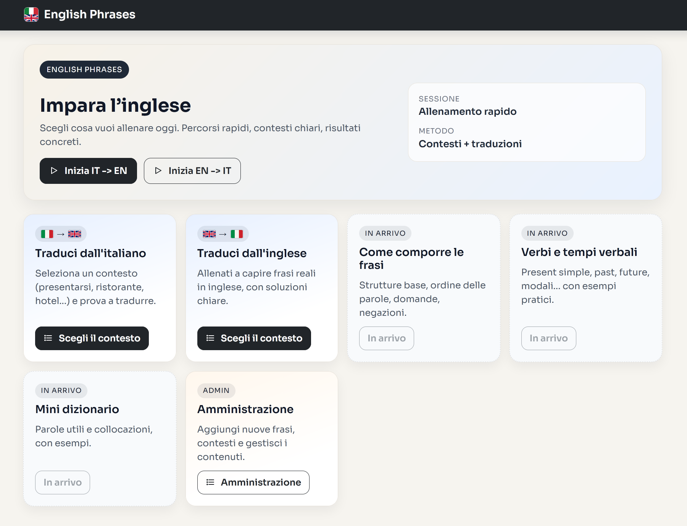
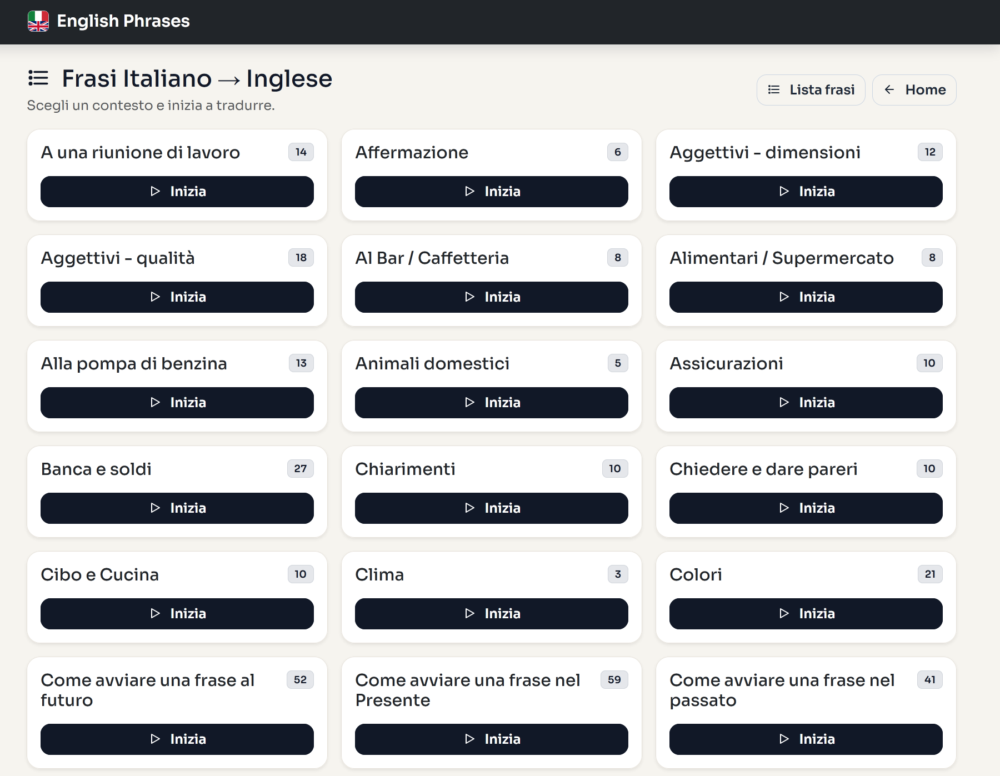
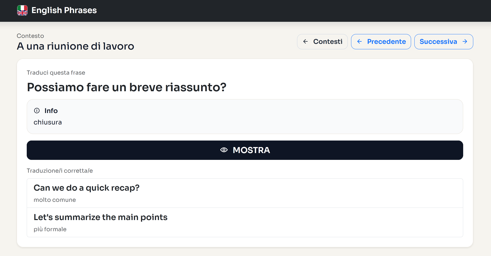

# English Phrases


App Symfony per allenarsi con frasi inglese/italiano organizzate per contesto, con area admin per la gestione dei contenuti.

## Screenshot




## Funzionalità
- Allenamento Frasi Italiano -> Inglese con contesti e traduzioni multiple.
- Allenamento Frasi Inglese -> Italiano con la stessa struttura.
- Area Admin protetta da login per creare e modificare frasi.
- Gestione Contesti con elenco, vista frasi e modifica descrizione.
- Gestione Frasi con elenco, modifica completa e cancellazione.

## Requisiti
- PHP >= 8.4
- Composer
- Database configurato (Doctrine ORM)

## Installazione
1. Clona il progetto e installa le dipendenze:

```bash
composer install
```

2. Configura il database in `.env` o `.env.local`.

3. Esegui migrazioni e fixtures:

```bash
php bin/console doctrine:migrations:migrate
php bin/console doctrine:fixtures:load
```

## Avvio in locale

```bash
symfony server:start
```

Oppure con PHP built-in:

```bash
php -S localhost:8000 -t public
```

## Utilizzo
- Home: `/`
- Frasi IT -> EN: `/frasi_iten/contesti`
- Frasi EN -> IT: `/frasi_enit/contesti`
- Admin: `/admin`

## Credenziali Admin (in memoria)
- Email: `test@gmail.com`
- Password: `Saltimb@nc0`

Le credenziali sono configurate in `config/packages/security.yaml`.

## Gestione Frasi (Admin)
- Lista frasi: `/admin/frasi`
- Modifica frase: pulsante Modifica nella lista
- Cancellazione: pulsante Elimina nella lista (con conferma)

## Gestione Contesti (Admin)
- Lista contesti: `/admin/contesti`
- Vedi frasi del contesto: pulsante Vedi
- Modifica descrizione: pulsante Modifica

## Deploy
1. Configura variabili d'ambiente di produzione (DB, APP_ENV=prod, APP_SECRET).
2. Installa dipendenze senza dev:

```bash
composer install --no-dev --optimize-autoloader
```

3. Esegui migrazioni in produzione:

```bash
php bin/console doctrine:migrations:migrate --no-interaction
```

4. Pulisci e riscalda la cache:

```bash
php bin/console cache:clear --env=prod
php bin/console cache:warmup --env=prod
```

## Note
- Le traduzioni multiple si inseriscono una per riga nel form admin.
- Se vuoi info sulle traduzioni, usa il formato `testo | info`.
